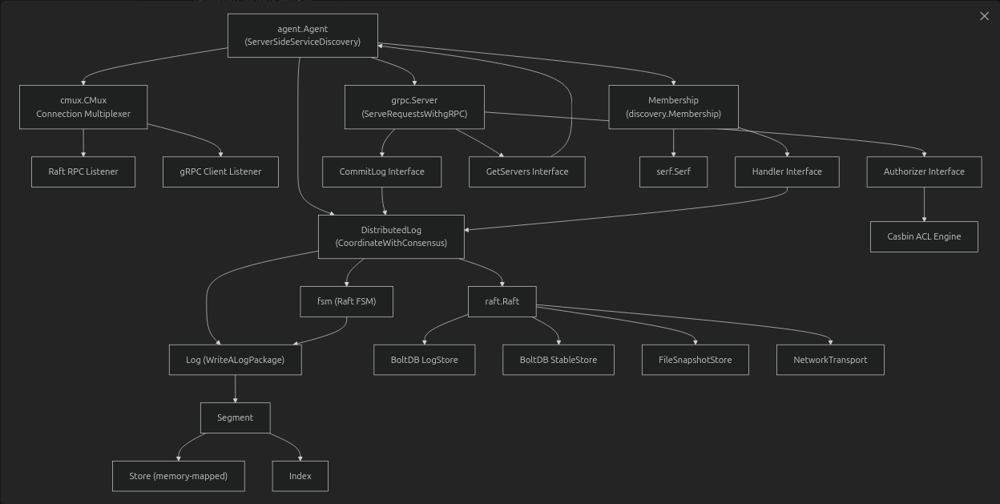
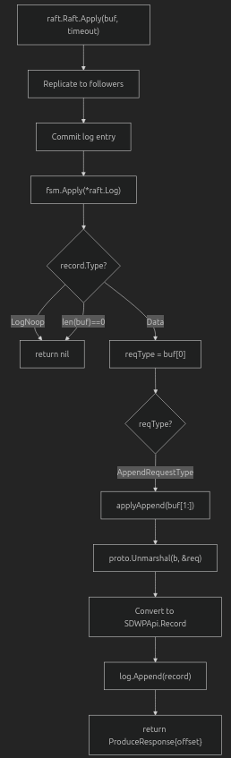

# Event-Streaming-System

[](https://deepwiki.com/GergesHany/Event-Streaming-System)

## Purpose and Scope

The Event-Streaming-System is a distributed event streaming platform that provides strong consistency guarantees via Raft consensus and dynamic service discovery via Serf. This document introduces the system's purpose, architecture, and main components. For detailed information on specific subsystems, see:

- **Agent orchestration and coordination**: [Agent Initialization Sequence](#agent-initialization-sequence)
- **Core components mapping**: [Core Components Mapped to Code](#core-components-mapped-to-code)
- **Connection multiplexing**: [Connection Multiplexing Architecture](#connection-multiplexing-architecture)
- **Distributed consensus implementation**: [DistributedLog and Raft Integration](#distributedlog-and-raft-integration)
- **FSM state machine**: [FSM State Machine Implementation](#fsm-state-machine-implementation)
- **Service discovery with Serf**: [Cluster Membership and Discovery](#cluster-membership-and-discovery)
- **Operational flows**: [Core Operational Flow](#core-operational-flow)
- **Getting started guide**: [Getting Started](#getting-started)

**Sources:**
- `ServerSideServiceDiscovery/pkg/agent/agent.go`
- `CoordinateWithConsensus/pkg/log/distributed.go`

---

## What is the Event-Streaming-System?

The Event-Streaming-System is a **distributed, replicated commit log service** that provides strong consistency guarantees through Raft consensus. Each node runs an **Agent** that orchestrates multiple subsystems: a gRPC server for client requests, a distributed log for data storage, and a membership service for cluster coordination. The system enables applications to produce and consume records in a fault-tolerant, linearizable manner across a cluster of nodes.

### Key Characteristics

| Characteristic | Implementation |
|----------------|----------------|
| **Consistency Model** | Linearizable writes via Raft consensus |
| **Replication** | Multi-node replication with automatic leader election |
| **Service Discovery** | Server-side discovery using Serf gossip protocol |
| **Cluster Membership** | Decentralized membership management with failure detection |
| **Fault Tolerance** | Operates with majority quorum available (e.g., 2 of 3 nodes) |
| **Communication** | gRPC with Protocol Buffers over TLS |
| **Security** | TLS authentication + Casbin ACL authorization |
| **Storage** | Segment-based write-ahead log with memory-mapped files |
| **Deployment** | Kubernetes StatefulSet via Helm |

**Sources:**
- `ServerSideServiceDiscovery/pkg/agent/agent.go` (lines 27-58)
- `CoordinateWithConsensus/pkg/log/distributed.go` (lines 28-32)
- `ServerSideServiceDiscovery/pkg/discovery/membership.go` (lines 10-28)

---

## Key Features

### Agent-Based Architecture

Each node runs an **Agent**. Agent orchestrates all subsystems on that node. The Agent manages the lifecycle of the gRPC server, distributed log, and membership service, providing a unified entry point for cluster operations. Defined in `ServerSideServiceDiscovery/pkg/agent/agent.go` (lines 27-48).

### Distributed Log Replication with Raft

The `DistributedLog` component provides strong consistency through Raft consensus. It implements the Raft finite state machine (FSM), requiring a majority quorum (e.g., 2 of 3 nodes) for stable data persistence. All writes go through the Raft leader, which replicates entries to followers before committing. Implementation in `CoordinateWithConsensus/pkg/log/distributed.go` (lines 28-212).

### Dynamic Service Discovery with Serf

The system uses HashiCorp Serf for decentralized cluster membership management. The `Membership` component maintains cluster metadata through gossip protocols, detecting node joins, leaves, and failures. When membership changes, the system automatically updates the Raft cluster configuration. Implementation in `ServerSideServiceDiscovery/pkg/discovery/membership.go` (lines 28-136).

### Automatic Leader Election and Failover

Raft automatically elects a new leader when the current leader fails. The system maintains availability as long as a majority quorum is maintained (e.g., 2 out of 3 nodes). Each node's gRPC server on followers can forward produce requests to the leader.

### Connection Multiplexing

Each node uses a connection multiplexer (`cmux`) to share a single port for both Raft-RPC traffic and gRPC client traffic. The multiplexer inspects incoming connections and routes them appropriately. Implementation in `ServerSideServiceDiscovery/pkg/agent/agent.go` (lines 225-236).

### Security and Authorization

The system enforces TLS-based authentication (extracting the subject from client certificates) and Casbin-based ACL authorization for all operations. The `authenticate` interceptor in `ServeRequestsWithgRPC/pkg/server/server.go` (lines 202-227) handles authentication, while the `Authorizer` enforces permissions.

**Sources:**
- `ServerSideServiceDiscovery/pkg/agent/agent.go` (lines 27-98)
- `CoordinateWithConsensus/pkg/log/distributed.go` (lines 58-212)
- `ServerSideServiceDiscovery/pkg/discovery/membership.go` (lines 38-82)
- `ServeRequestsWithgRPC/pkg/server/server.go` (lines 74-127)

---

## High-Level Architecture

### System Component Hierarchy

The system follows a layered architecture with the `Agent` as the primary orchestrator:



#### Component Hierarchy and Dependencies

```
gRPC Agent
├── Configuration Management
│   ├── Server TLS Config
│   ├── Peer TLS Config
│   ├── Data Directory
│   └── Bind Address & RPC Port
│
├── Connection Multiplexer (cmux)
│   ├── Raft RPC Traffic
│   └── gRPC Client Traffic
│
├── Distributed Log (Raft FSM)
│   ├── Log (Write-Ahead Log)
│   │   ├── Active Segment
│   │   └── Segments
│   │       ├── Store (append-only file)
│   │       └── Index (offset mapping)
│   │
│   ├── Raft Components
│   │   ├── FSM (Finite State Machine)
│   │   ├── Log Store (BoltDB)
│   │   ├── Stable Store (BoltDB)
│   │   ├── Snapshot Store
│   │   └── Network Transport
│   │
│   └── Replication
│       └── Leader → Followers
│
├── gRPC Server
│   ├── Produce/Consume APIs
│   ├── Streaming Operations
│   ├── GetServers API
│   └── Interceptors
│       ├── Authentication (TLS)
│       └── Authorization (Casbin)
│
└── Membership (Serf)
    ├── Node Discovery
    ├── Failure Detection
    └── Cluster Events
        ├── Join
        └── Leave
```

**Sources:**
- `ServerSideServiceDiscovery/pkg/agent/agent.go` (lines 27-98)
- `CoordinateWithConsensus/pkg/log/distributed.go` (lines 28-212)
- `ServerSideServiceDiscovery/pkg/discovery/membership.go` (lines 22-43)

---

## Module Organization

The Event-Streaming-System is organized into modular packages, each focused on a specific concern. This separation promotes code reuse and allows independent development of distributed log features.

| Module | Key Files/Components | Responsibility |
|--------|---------------------|----------------|
| **ServerSideServiceDiscovery** | `pkg/agent/agent.go`<br>`pkg/discovery/membership.go` | Agent orchestration: coordinates gRPC server, distributed log, and membership. Implements server-side service discovery using Serf gossip protocol for cluster coordination and failure detection. |
| **CoordinateWithConsensus** | `pkg/log/distributed.go`<br>`pkg/discovery/membership.go` | Raft consensus integration: wraps the commit log with Raft replication. Implements the Raft FSM (finite state machine) for distributed log consistency and leader election. |
| **ServeRequestsWithgRPC** | `pkg/server/server.go`<br>`api/v1/grpc_log.proto` | gRPC service implementation: exposes Produce, Consume, ProduceStream, ConsumeStream, and GetServers APIs. Includes authentication and authorization interceptors for secure access control. |
| **WriteALogPackage** | `log/log.go`<br>`log/segment.go`<br>`log/store.go`<br>`log/index.go` | Write-ahead log storage: manages segment-based append-only logs with memory-mapped files. Handles segment creation, rotation, and compaction. Provides offset-based indexing for efficient reads. |
| **StructureDataWithProtobuf** | `api/v1/log.proto`<br>`api/v1/grpc_log.proto` | Protocol Buffer definitions: defines the gRPC service interface and message structures for client-server communication. Generates Go code for type-safe serialization. |
| **SecurityAndObservability** | `pkg/auth/authorizer.go`<br>`pkg/config/tls.go`<br>`pkg/config/files.go` | Security and monitoring: implements Casbin-based ACL authorization, TLS certificate configuration for mutual authentication, and structured logging with observability hooks. |

**Sources:**
- `ServerSideServiceDiscovery/pkg/agent/agent.go`
- `CoordinateWithConsensus/pkg/log/distributed.go`
- `ServeRequestsWithgRPC/pkg/server/server.go`
- `WriteALogPackage/log/log.go`
- `StructureDataWithProtobuf/api/v1/grpc_log.proto`
- `SecurityAndObservability/pkg/auth/authorizer.go`

---

## Agent Initialization Sequence

The `Agent` orchestrates all subsystems on each node. The initialization follows a strict sequence defined in `ServerSideServiceDiscovery/pkg/agent/agent.go` (lines 68-101).

### Agent Setup Sequence

The initialization process creates and configures each component in the following order:

1. **Start Multiplexer** - Creates a TCP listener on the configured bind address and starts the connection multiplexer (`cmux`) to route incoming connections
2. **Create ServerTLSConfig** - Configures TLS for the gRPC server to authenticate clients
3. **Create PeerTLSConfig** - Configures TLS for Raft peer-to-peer communication
4. **Setup DistributedLog** - Initializes the distributed log with Raft consensus integration
5. **Register gRPC Services** - Registers the gRPC service handlers (Produce, Consume, etc.)
6. **Setup Membership** - Initializes Serf membership for cluster coordination
7. **Bootstrap Raft** - Configures Raft cluster membership based on discovery
8. **Start gRPC Server** - Begins accepting gRPC client requests
9. **Start Raft Listener** - Begins accepting Raft RPC connections from peers


Each component depends on the previous ones being successfully initialized. If any step fails, the Agent shuts down gracefully, closing all initialized components in reverse order.

**Sources:**
- `ServerSideServiceDiscovery/pkg/agent/agent.go` (lines 68-101)

---

## Connection Multiplexing Architecture

The `cmux.CMux` enables a single port to handle both Raft peer traffic and gRPC client traffic. The multiplexer inspects the first byte of incoming TCP connections to determine the protocol and routes them appropriately.

### cmux Routing Logic

The connection multiplexer uses protocol detection to route traffic:

1. **TCP Connection to :RPCPort** - Incoming connection on the configured bind address
2. **cmux.CMux (agent.go:234)** - Connection multiplexer inspects the connection
3. **Inspect First Byte** - Reads the first byte to determine the protocol type

   **Decision Point:**
   - **Match byte == log.RaftRPC?**
     - **Yes** → Routes to **Raft RPC Listener** (agent.go:103-109)
       - Passes to **log.StreamLayer**
       - Connects to **raft.NetworkTransport** for Raft consensus communication
   
   - **No** → **Match cmux.Any()?**
     - **Yes** → Routes to **gRPC Listener** (agent.go:165)
       - Passes to **grpc.Server.Serve()**
       - Connects to **api.LogServer methods** (Produce, Consume, etc.)


This architecture allows the system to share a single port between Raft internal replication traffic and external client gRPC requests, simplifying network configuration and firewall rules.

**Sources:**
- `ServerSideServiceDiscovery/pkg/agent/agent.go` (lines 102-109, 103-124, 234-236)

---

## Core Operational Flow

Request Processing Pipeline

---

Write Path (Produce Operation)

.png)


## Core Operational Flow

Request Processing Pipeline

---

Write Path (Produce Operation)

.png)

---

Read Path (Consume Operation)

.png)


**Sources:**

- `ServeRequestsWithgRPC/pkg/server/server.go` 129-151
- `CoordinateWithConsensus/pkg/log/distributed.go` 222-287
- `ServerSideServiceDiscovery/pkg/agent/agent.go` 102-143

---

## Cluster Membership and Discovery

Serf Membership Event Processing


**Sources:**
- `ServerSideServiceDiscovery/pkg/discovery/membership.go` 84-118
- `CoordinateWithConsensus/pkg/log/distributed.go` 465-497


---

## Core Components Mapped to Code

### Agent Initialization Sequence

The `agent.Agent` orchestrates all subsystems on each node. The initialization follows a strict sequence defined in `ServerSideServiceDiscovery/pkg/agent/agent.go` (lines 68-89).


Each component depends on the previous ones being successfully initialized. If any step fails, the Agent shuts down gracefully, closing all initialized components in reverse order.

**Sources:**
- `ServerSideServiceDiscovery/pkg/agent/agent.go` (lines 68-101)

---

## Connection Multiplexing Architecture

The `cmux.CMux` enables a single port to handle both Raft peer traffic and gRPC client traffic. The multiplexer inspects the first byte of incoming TCP connections to determine the protocol and routes them appropriately.

### cmux Routing Logic

The connection multiplexer uses protocol detection to route traffic:

1. **TCP Connection to :RPCPort** - Incoming connection on the configured bind address
2. **cmux.CMux (agent.go:234)** - Connection multiplexer inspects the connection
3. **Inspect First Byte** - Reads the first byte to determine the protocol type

   **Decision Point:**
   - **Match byte == log.RaftRPC?**
     - **Yes** → Routes to **Raft RPC Listener** (agent.go:103-109)
       - Passes to **log.StreamLayer**
       - Connects to **raft.NetworkTransport** for Raft consensus communication
   
   - **No** → **Match cmux.Any()?**
     - **Yes** → Routes to **gRPC Listener** (agent.go:165)
       - Passes to **grpc.Server.Serve()**
       - Connects to **api.LogServer methods** (Produce, Consume, etc.)


This architecture allows the system to share a single port between Raft internal replication traffic and external client gRPC requests, simplifying network configuration and firewall rules.

**Sources:**
- `ServerSideServiceDiscovery/pkg/agent/agent.go` (lines 102-109, 103-124, 234-236)

---


## DistributedLog and Raft Integration

The `DistributedLog implements` the Raft consensus algorithm by providing all five required components:

Raft Component Implementation


**Sources:**
- `CoordinateWithConsensus/pkg/log/distributed.go` (lines 58-212)


---

## FSM State Machine Implementation

The `fsm` struct implements the `raft.FSM` interface, applying committed Raft entries to the underlying log:

FSM Apply Logic



**Sources:**
- `CoordinateWithConsensus/pkg/log/distributed.go` (lines 293-330)

---

---

## Navigation to Detailed Documentation

The following sections provide detailed documentation for each subsystem:

| Section | Page | Key Topics |
|---------|------|------------|
| **Architecture** | [Architecture](#high-level-architecture) | System design, component interactions, data flows |
| **Agent Orchestration** | [Agent Orchestration](#core-components-mapped-to-code) | Agent lifecycle, setup sequence, shutdown procedures |
| **Raft Consensus** | [Distributed Consensus with Raft](#distributed-consensus-with-raft) | Leader election, log replication, FSM state machine |
| **Service Discovery** | [Service Discovery with Serf](#service-discovery-with-serf) | Serf gossip, membership events, cluster coordination |
| **Storage Layer** | [Storage Layer Architecture](#storage-layer-architecture) | Segments, indexes, write-ahead log implementation |
| **Core Components** | [Core Components](#core-components-mapped-to-code) | Individual component deep dives |
| **Security** | [Authentication and Authorization](#security-and-authorization) | TLS authentication, Casbin ACL, certificate management |
| **Network Communication** | [Network Communication](#connection-multiplexing-architecture) | cmux multiplexing, StreamLayer, protocol handling |
| **Data Model** | [Data Model](#what-is-the-event-streaming-system) | Protocol Buffer schemas, record structure, offsets |
| **gRPC API** | [gRPC API](#api-reference) | Service methods, request/response types, error codes |
| **Deployment** | [Deployment](#deployment) | StatefulSet configuration, persistent volumes, services |
| **Development** | [Development Guide](#module-organization) | Building, testing, dependencies, configuration |

**Sources:**
- `ServerSideServiceDiscovery/pkg/agent/agent.go` (lines 1-264)
- `CoordinateWithConsensus/pkg/log/distributed.go` (lines 1-543)
- `ServerSideServiceDiscovery/pkg/discovery/membership.go` (lines 1-137)

---

## Getting Started

### Running a Single Node

Start the StreamingSystem agent:

```bash
# Start the StreamingSystem agent
./StreamingSystem \
  --config-file=/tmp/config.yaml \
  --data-dir=/tmp/streaming-system/node-0 \
  --rpc-port=8400 \
  --bind-addr=127.0.0.1:8401 \
  --bootstrap=true
```

The `main.go` entry point in `Deploy/cmd/StreamingSystem/main.go` (lines 30-47) uses `cobra.Command` to parse these flags and instantiates an `agent.Agent` at `Deploy/cmd/StreamingSystem/main.go` (line 149).

### Connecting a Client

```go
import (
    "google.golang.org/grpc"
    "github.com/GergesHany/Event-Streaming-System/ClientSideServiceDiscovery/pkg/loadbalance"
)

conn, err := grpc.Dial(
    fmt.Sprintf("%s:///%s", loadbalance.Name, "localhost:8400"),
    grpc.WithDefaultServiceConfig(
        fmt.Sprintf(`{"loadBalancingConfig":[{"%s":{}}]}`, loadbalance.Name),
    ),
)
```

The `loadbalance.Name` constant is `"StreamingSystem"`, which triggers the custom `Resolver` registered in `ClientSideServiceDiscovery/pkg/loadbalance/resolver.go`.

### Kubernetes Deployment

```bash
# Deploy using Helm
helm install streaming-system ./Deploy/deploy/StreamingSystem
```

This creates a StatefulSet with 3 replicas (configurable), where pod-0 bootstraps the cluster and pods 1-2 join via Serf. See Kubernetes Deployment with Helm for details.

**Sources:**
- `Deploy/cmd/StreamingSystem/main.go` (lines 49-85)
- `ClientSideServiceDiscovery/README.md` (lines 58-73)

---